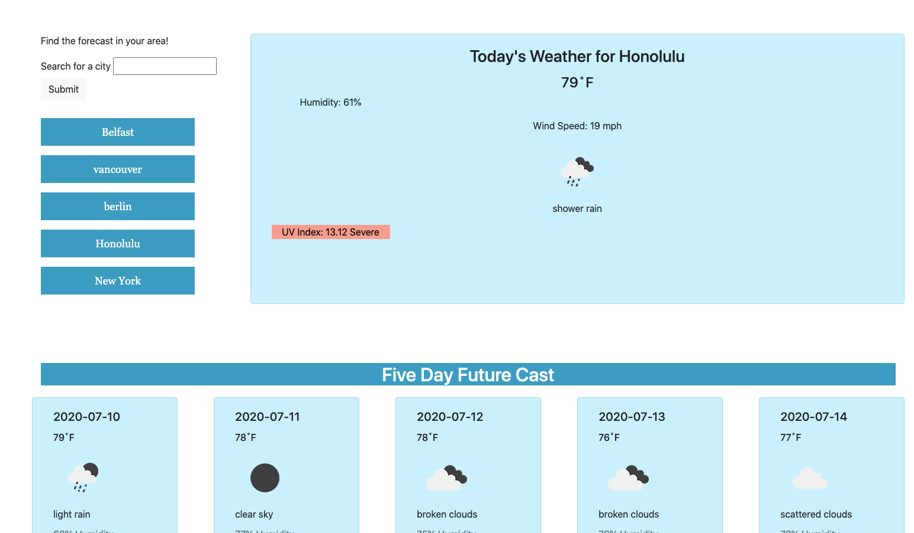

# Weather Dashboard

## Purpose
To find the weather in the user's local area that includes the temperature, the UV index, the wind speed, the humidity, and a brief description of weather conditions.

## How to Use
Click on the text box to the left next to "Search for a city". Enter any city name in the US or in the world and click submit. To look at any of the last five searches again, click on the name of the city in the list below the search box. 

## Link
https://nikcastle.github.io/weather-dashboard/

## Images
</img>

## Author
Nikki Castle
with the use of OpenWeather API,
Bootstrap CSS,
JQuery